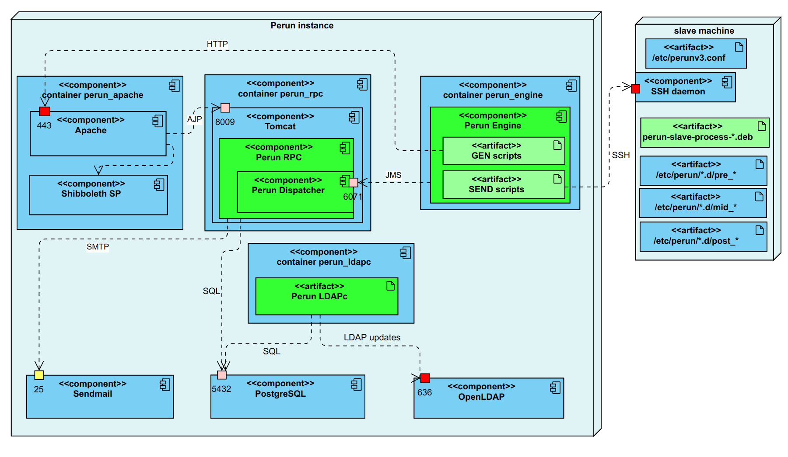

# Perun Ansible script

This repository serves for easier deployment of Perun server with default configuration.

## Overview



This Ansible playbook installs an instance of [Perun](https://perun-aai.org/). Its main part is the **Perun RPC** web application,
which is deployed into **Tomcat** servlet container. The Tomcat is not accessible directly from outside, it is behind
an **Apache** web server, which forwards requests to the Tomcat using AJP protocol. Apache uses **Shibboleth SP** plugin 
and its associated daemon for federated authentication based on SAML protocol.

The Perun RPC application stores data in **PostgreSQL** relational database.
 
Selected data from the Perun database are made available through an OpenLDAP server. 
A separate process called **LDAP Connector (LDAPc)** observes changes in the database and modifies the LDAP
directory in real-time. 

A separate process called **Perun Engine** controls slave machines. It communicates using JMS with **Perun Dispatcher**,
which is located inside of the Perun RPC. Dispatcher observes changes in database and instructs Engine 
to update some services on some slave machines.
For each service on a machine, Engine runs a GEN script, which uses HTTP to obtain data from RPC 
and generates files to be transferred to the slave machine.
Then Engine runs a SEND script, which connects to the slave machine using the Secure Shell (ssh)
protocol, transfers the generated files, and executes so-called slave scripts installed on the machines from DEB or RPM packages. 
An administrator of a slave machine can tune the slave scripts by adding so-called pre-hook, mid-hook and post-hook
scripts to the directory /etc/perun/&lt;service&gt;.d/      
 
## Requirements

 - 64-bit Debian system (version 10 or 11)
 - Requires at least 8GB free disk space
 - Ideally dedicated 2 CPUs and at least 4GB RAM

## TL;DR for the impatient

```$bash
sudo apt install ansible
git clone https://github.com/CESNET/perun-ansible.git
cd perun-ansible
git submodule update --init --recursive
MY_PERUN_MACHINE=perun.mysite.org
sed -i -e "s/perun.example.org/$MY_PERUN_MACHINE/" hosts
echo >.password "test"
ansible-playbook playbook_perun.yml

firefox https://perun:test@$MY_PERUN_MACHINE/ba/gui/
```
All passwords are set to "test".

## Installation of Ansible

- First you need to install Ansible to your system, which will be used to install Perun to remote server (or localhost).
- Install Ansible following the guide [Installing Ansible](https://docs.ansible.com/ansible/latest/installation_guide/intro_installation.html)
- **The required version of Ansible is 5!**
- **You must be able to log into the remote server**, thus your public SSH key must be placed in the file /root/.ssh/authorized_keys on the remote server.
- **SSH and Python must be installed on both sides of communication.**

## Clone this repo

- Download this repository from Github and update its submodules: 
```$bash
git clone https://github.com/CESNET/perun-ansible.git
cd perun-ansible
git submodule update --init --recursive
```  

## Set address of your server in the inventory file

- In **hosts** file you must set hostname of your Perun server. It should be a publicly accessible DNS name,
  because TLS certificates will be issued for it. 

## Create configuration files for your host

- You do not need to configure anything for a default installation, just skip this section.
- For a single machine, you can set variables in the file **group_vars/all/vars.yml** which is used for all machines. 
- For more than one machine, create a new folder under **host_vars/** named exactly as your host in the inventory file and put a YAML file with variables there
- The playbook looks for files in the directory **files/{{ perun_instance_hostname }}/** where the variable 
  perun_instance_hostname has by default the same value as inventory_hostname which contains the name
  of the machine from the Ansible inventory (the **hosts** file).

## Run Ansible playbook

- Now you can run Ansible playbook with this command (you need to be in the downloaded Ansible repository).
  - `ansible-playbook playbook_perun.yml`
- Perun should be running after installation on **https://[hostname]/ba/gui/**. Username is "perun", password is "test".

## After installation

Now you need to do stuff, which is not handled by Ansible script:

- **Install slave scripts at slave machines**
  - The slave scripts should be installed at the machines that Perun will control, not at the Perun server!
  - Add APT repository by creating file /etc/apt/sources.list.d/meta_repo.list containing the line `deb ftp://repo.metacentrum.cz/ all main pilot` and run `apt-get update`
  - Install slave scripts for each needed service, e.g.: `apt-get install perun-slave-process-passwd` for installation of **passwd service**
  - For **all services** install meta package perun-slave-full: `apt-get install perun-slave-full`
