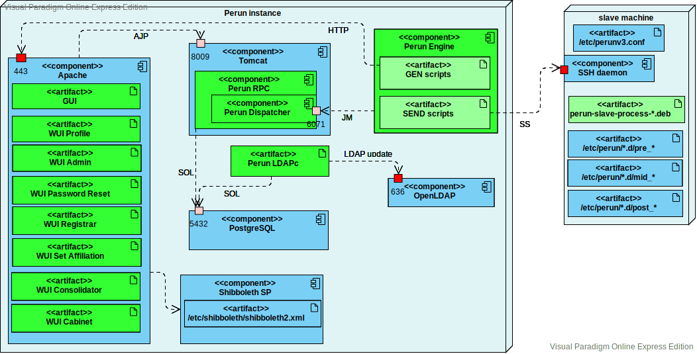

# Perun Ansible script

This repository serves for easier deployment of Perun server with default configuration.

## Overview



This Ansible playbook installs an instance of [Perun](https://perun-aai.org/). Its main part is the **Perun RPC** web application,
which is deployed into **Tomcat** servlet container. The Tomcat is not accessible directly from outside, it is behind
an **Apache** web server, which forwards requests to the Tomcat using AJP protocol. Apache uses **Shibboleth SP** plugin 
and its associated daemon for federated authentication based on SAML protocol.

The Perun RPC application stores data in **PostgreSQL** relational database.
 
Selected data from the Perun database are made available through an OpenLDAP server. 
A separate process called **LDAP Connector (LDAPc)** observes changes in the database and modifies the LDAP
directory in real-time. 

A separate process called **Perun Engine** controls slave machines. It communicates using JMS with **Perun Dispatcher**,
which is located inside of the Perun RPC. Dispatcher observes changes in database and instructs Engine 
to update some services on some slave machines.
For each service on a machine, Engine runs a GEN script, which uses HTTP to obtain data from RPC 
and generates files to be transferred to the slave machine.
Then Engine runs a SEND script, which connects to the slave machine using the Secure Shell (ssh)
protocol, transfers the generated files, and executes so-called slave scripts installed on the machines from DEB or RPM packages. 
An administrator of a slave machine can tune the slave scripts by adding so-called pre-hook, mid-hook and post-hook
scripts to the directory /etc/perun/&lt;service&gt;.d/      
 
## Requirements

 - 64-bit Debian system (version 9 or 10)
 - Requires at least 8GB free disk space
 - Ideally dedicated 2 CPUs and at least 4GB RAM

## TL;DR for the impatient

```$bash
sudo apt install ansible
git clone https://github.com/CESNET/perun-ansible.git
cd perun-ansible
git submodule update --init --recursive
MY_PERUN_MACHINE=perun.mysite.org
cp -r host_vars/perun.example.com/ host_vars/$MY_PERUN_MACHINE
sed -i -e "s/production-perun.awesomesite.cz/$MY_PERUN_MACHINE/" inventories/prod
echo >.password "test"
ansible-playbook -i inventories/prod site.yml

firefox https://perun:test@$MY_PERUN_MACHINE/ba/gui/
```

## Installation of Ansible

- First you need to install Ansible to your system ([Installation of Ansible](http://docs.ansible.com/ansible/intro_installation.html)), which will be used to install Perun to remote server (or localhost).
- **The minimal version of Ansible is 2.9!**
- **You must be able to log into the remote server**, thus your public SSH key must be placed in the file /root/.ssh/authorized_keys on the remote server.
- **SSH and Python must be installed on both sides of communication.**

## Clone this repo

- Now you need to download our Ansible repository from our Github
  - [Perun-Ansible repository](https://github.com/CESNET/perun-ansible)

## Install TLS certificates

- At the target machine, preferably in the **/etc/perun/ssl** folder, generate a private key and a certificate request
- Get TLS certificate from a reputable certification authority together with the CA's chain of certificates from a trusted root CA 
- Put the certificate and chain files to the folder with the private key. 
- Install package **ssl-cert** and change the owning group of the private key file to the group **ssl-cert** (needed for LDAP and PostgreSQL servers to access it) 
- You will have to renew the certificate every couple of years, so we recommend to name the actual files with the certificate, key and chain in a way that marks the year in which they were issued, and to create symbolic links named like cert.pem, key.pem and chain.pem that you will use in all configuration files. In such setup, after renewing the certificate, you will just change the symbolic links instead of all configuration files.

## Set address of your server in inventories

- In **./inventories/prod** file you must **set hostname or ip address** of your Perun server. If you have some test server, you can set it in ./inventories/test file too.
- Ansible_user variable mentioned behind your hostname is user, which has root privileges (default root).
- For example fill this file with this row: **perun.example.com ansible_user=root**

## Create configuration files for your host

- Create a new folder under **host_vars/** named exactly as your host in the inventory file
- Copy there files **vars.yml** and **passwords.yml** from the folder **host_vars/perun.example.com/**
- Edit the file **vars.yml** with any text editor and set all variables to real values
- Change password of the **passwords.yml** vault with command: `ansible-vault rekey passwords.yml` (Default password is set to "test".)
- Edit the vault file with command `ansible-vault edit passwords.yml` and set real values
- If you have more than one Perun server, just create a folder with vars.yml and passwords.yml files under the host_vars/ folder for each server.

## Run Ansible playbook

- Now you can run ansible script with this command (**you need to be in downloaded Ansible repository**). It uses hostname from ./inventories/prod file. You can change it to ./inventories/test (or dev) to use hostname from another inventory.
  - `ansible-playbook -i inventories/prod --ask-vault-pass site.yml`
  - It will ask for your vault password (the file which stores passwords meantioned before)

- Perun should be running after installation on **https://[hostname]/[auth-type]/rpc/**, where [auth-type] is either cert for certificates, non for non-authorized access and ba for basic auth (our initial user perun).
- For example: **https://[hostname]/ba/gui/** will show GUI of Perun. First you need to fill username and password (user: perun, password: the one you set in passwords.yml file in password_perun_admin variable).

## After installation

Now you need to do stuff, which is not handled by Ansible script:

- **Generate SSH key for Perun for accessing slave machines**
  - As perun user use command: `ssh-keygen -t rsa -C "perun@[perun's_address]" -f ~/.ssh/id_rsa`
  - Public part of key must be set in /root/.ssh/authorized_keys on each slave machine to be controlled by Perun. 

- **Add certificates to truststore**
  - The truststore have to contain certificates of servers, which are contacted by Perun. More precisely, chain of their parent certificates (if they are not distributed with Java / browser). Keytool is used to add them:
  - `keytool -keystore /home/perun/.truststore -importcert -trustcacerts -file /tmp/file_with_cert -alias [cert alias, e.g. rt4.cesnet.cz]`

- **Install slave scripts at slave machines**
  - The slave scripts should be installed at the machines that Perun will control, not at the Perun server!
  - Add APT repository by creating file /etc/apt/sources.list.d/meta_repo.list containing the line `deb ftp://repo.metacentrum.cz/ all main pilot` and run `apt-get update`
  - Install slave scripts for each needed service, e.g.: `apt-get install perun-slave-process-passwd` for installation of **passwd service**
  - For **all services** install meta package perun-slave-full: `apt-get install perun-slave-full`
